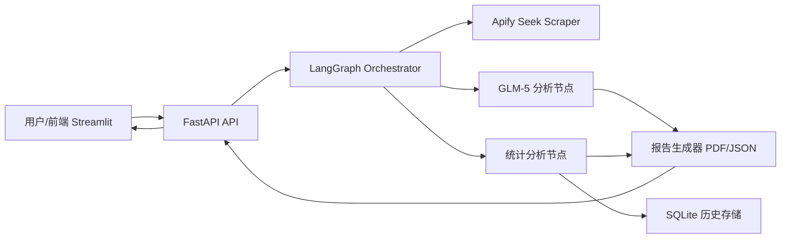

# AU Job Market Research Agent

一个基于 AI Agent 的澳洲职位市场研究工具，用于自动抓取 Seek 职位信息、解析 JD 内容并生成可视化分析报告，帮助你快速理解技能需求、薪资分布与市场趋势。

> 面向开源社区，本项目以 **AI Agent 驱动** 为核心，基于 **LangGraph 多 Agent 工作流** 组织数据采集、结构化抽取、统计分析与报告生成；结合 **GLM-5 + Prompt Engineering**，支持对职位描述进行可解释、可复用的 LLM 深度分析。


## ✨ 功能特性

### 核心功能
- 🔍 **智能职位搜索**: 通过 Apify Seek Scraper 抓取澳洲职位数据
- 🤖 **LLM 深度分析**: 使用 GLM-5 提取技能、经验、行业关键词等结构化信息
- 📊 **市场洞察报告**: 自动生成包含图表的分析报告
- 📄 **PDF 导出**: 专业排版的 PDF 报告，支持中文图表
- 💾 **历史记录**: SQLite 持久化存储，可回顾历史分析

### 报告模块 (A-J 结构)
| 模块 | 内容 |
|------|------|
| A | 报告元信息（查询参数、生成时间） |
| B | 样本概览（样本量、雇主数、城市数、薪资覆盖率） |
| C | 需求侧分析（趋势、职位类型、热门地区） |
| D | 薪资分析（饼状图 + 数据表格） |
| E | 竞争强度（申请人数统计） |
| F | 技能画像（饼状图 + 数据表格） |
| G | 雇主画像 |
| H | TOP3 职位推荐 |
| I | 深度分析（LLM 生成的行业洞察） |
| J | 求职建议（个性化职业指导） |

### 数据过滤
- 低薪资自动过滤（时薪 < 24 AUD 或年薪 < 50,000 AUD）
- 支持自定义查询条件和结果数量

## 🛠 技术栈

| 层级 | 技术 |
|------|------|
| 后端 | FastAPI, LangGraph, LangChain |
| 前端 | Streamlit, Plotly |
| LLM | GLM-5 (联通元景 OpenAI-compatible API) |
| 数据源 | Apify (websift~seek-job-scraper) |
| PDF | WeasyPrint, Matplotlib |
| 测试 | pytest, LocalASGIClient |
| 部署 | Docker, Railway |

### 技术选型理由

| 技术 | 选型理由 |
|------|----------|
| LangGraph | 将职位分析流程拆分为可组合节点，天然适配多 Agent 编排、状态管理与可观测执行链路。 |
| GLM-5 | 提供稳定的中文/英文理解与结构化提取能力，适合 JD 场景下的技能、经验、行业信号分析。 |
| Prompt Engineering | 通过模板化提示词与约束输出格式，提高提取一致性，降低幻觉并提升可评估性。 |
| FastAPI | 轻量高性能，便于构建可测试的异步 API 服务，并快速对接前端与自动化流水线。 |
| Streamlit + Plotly | 低门槛构建数据产品 UI，快速迭代图表与分析交互。 |
| Apify | 统一采集入口，降低爬取实现复杂度，聚焦上层 AI 分析能力。 |

## 🧠 架构概览

### 简化架构图



### 数据流说明

1. 前端提交查询条件到 FastAPI。
2. FastAPI 触发 LangGraph 工作流，按节点顺序执行采集、清洗、分析、汇总。
3. Apify 节点拉取原始职位数据，LLM 节点执行 JD 深度语义解析与结构化抽取。
4. 统计节点聚合薪资、技能、地区、竞争度等指标，并写入 SQLite 历史记录。
5. 报告生成节点输出可视化数据与 PDF 报告，再由 API 返回前端展示与下载。

## 📁 项目结构

```text
job-market-research-agent/
├── backend/                    # 后端服务与 Agent 工作流
│   ├── agents/                 # LangGraph 节点与流程
│   │   ├── state.py            # 状态定义
│   │   ├── nodes.py            # 节点函数
│   │   └── graph.py            # 图定义
│   ├── api/                    # FastAPI 路由与数据模型
│   │   ├── routes.py           # API 端点
│   │   └── schemas.py          # Pydantic 模型
│   ├── services/               # 核心服务
│   │   ├── apify_client.py     # Apify API 封装
│   │   ├── llm_client.py       # LLM 客户端
│   │   ├── jd_analyzer.py      # JD 分析服务
│   │   ├── statistics.py       # 统计分析服务
│   │   ├── report_generator.py # PDF 报告生成
│   │   └── database.py         # SQLite 持久化
│   ├── templates/              # Jinja2 HTML 模板
│   └── tests/                  # 后端测试
├── frontend/                   # Streamlit 前端应用
│   ├── app.py                  # 主入口
│   ├── pages/                  # 多页面 UI
│   │   ├── 1_🔍_Job_Search.py
│   │   ├── 2_📊_Market_Analysis.py
│   │   └── 3_📋_History.py
│   └── utils/                  # 前端工具函数
├── docs/                       # 文档
├── .env.example                # 开发环境变量模板
├── .env.production.example     # 生产环境变量模板
├── docker-compose.yml          # 本地部署编排
├── Dockerfile                  # 后端镜像
└── README.md
```

## 🚀 快速开始

### 本地开发

1. **克隆仓库**
```bash
git clone https://github.com/pioneer1541/AU-Job-Market-Research-Agent.git
cd AU-Job-Market-Research-Agent
```

2. **创建虚拟环境并安装依赖**
```bash
python -m venv .venv
source .venv/bin/activate  # Linux/macOS
# .venv\Scripts\activate   # Windows
pip install -r requirements-dev.txt
```

3. **配置环境变量**
```bash
cp .env.example .env
# 编辑 .env 文件，填写真实 API 密钥
```

4. **启动后端**
```bash
uvicorn backend.main:app --host 0.0.0.0 --port 8000 --reload
```

5. **启动前端（新终端）**
```bash
streamlit run frontend/app.py
```

### 运行测试

```bash
pytest -q
```

## ⚡ 快速体验

### 方式一：最短路径体验核心能力

1. 启动后端：`uvicorn backend.main:app --host 0.0.0.0 --port 8000 --reload`
2. 启动前端：`streamlit run frontend/app.py`
3. 在页面输入关键词（如 `data analyst`）和城市（如 `Sydney`），即可触发采集 + LLM 分析 + 报告生成。

### 方式二：直接调用 API

```bash
curl -X POST "http://127.0.0.1:8000/api/v1/analyze" \
  -H "Content-Type: application/json" \
  -d '{
    "query": "data analyst",
    "location": "Sydney",
    "pages": 2
  }'
```

```bash
curl "http://127.0.0.1:8000/health"
```

## ⚙️ 环境变量

| 变量名 | 说明 | 必填 |
|--------|------|------|
| `LLM_API_KEY` | LLM API 密钥 | ✅ |
| `LLM_BASE_URL` | LLM API 地址 | ✅ |
| `APIFY_API_TOKEN` | Apify API Token | ✅ |
| `ENABLE_PAID_APIS` | 是否启用付费 API | ❌ (默认 false) |
| `APP_ENV` | 运行环境 | ❌ |
| `LOG_LEVEL` | 日志级别 | ❌ |

详细说明见 [docs/environment-variables.md](docs/environment-variables.md)

## 🐳 部署

### Railway 部署（推荐）

本项目已在 Railway 部署，采用前后端分离架构：

| 服务 | URL |
|------|-----|
| 后端 | https://web-production-35c6c.up.railway.app/ |

#### 部署步骤

1. **后端 Service**
   - Root Directory: `/`
   - 使用 `railway.toml`
   - 配置环境变量: `LLM_API_KEY`, `LLM_BASE_URL`, `APIFY_API_TOKEN`

2. **前端 Service**
   - Root Directory: `frontend`
   - 使用 `frontend/railway.toml`
   - 配置环境变量: `BACKEND_URL=https://web-production-xxx.up.railway.app`

### Docker Compose

```bash
cp .env.production.example .env
docker compose up -d --build
```

## 📊 开发进度

### 已完成 ✅

| 阶段 | 内容 |
|------|------|
| Phase 1 | 项目初始化 + LangGraph 架构 |
| Phase 2 | FastAPI 后端 + Streamlit 前端 |
| Phase 3 | Railway 生产部署 |
| Phase 3.5 | PDF 报告 + Bug 修复 + 功能增强 |

当前状态：**Phase 3.5 已完成**，核心流程（采集、LLM 分析、可视化、PDF 导出、历史记录）可用。

### 进行中 🚧

| 阶段 | 内容 |
|------|------|
| Phase 4 | Portfolio 文档 + 项目展示 |

当前迭代重点：**Phase 4 进行中**，持续完善文档体系、工程化质量与开源协作体验。

### 计划中 📋

- [ ] 更多数据源支持 (LinkedIn, Indeed)
- [ ] 技能聚类分析
- [ ] 地区对比功能
- [ ] 薪资趋势预测
- [ ] CI/CD 质量门禁

## 🔒 安全注意事项

- ⚠️ 不要提交 `.env` 文件到版本控制
- ⚠️ 不要在代码中硬编码 API 密钥
- ✅ 使用 Railway Secret 管理敏感变量
- ✅ `ENABLE_PAID_APIS=false` 防止意外 API 调用

## 🤝 贡献指南

欢迎通过 Issue / PR 参与共建，贡献流程请参考：[CONTRIBUTING.md](CONTRIBUTING.md)（待创建）。

## 📚 文档导航

- 架构文档：[docs/architecture.md](docs/architecture.md)
- API 文档：[docs/api-reference.md](docs/api-reference.md)
- 环境变量文档：[docs/environment-variables.md](docs/environment-variables.md)

## 📝 License

MIT License

---

**Built with ❤️ by Vincent**
