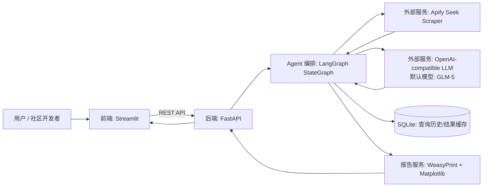
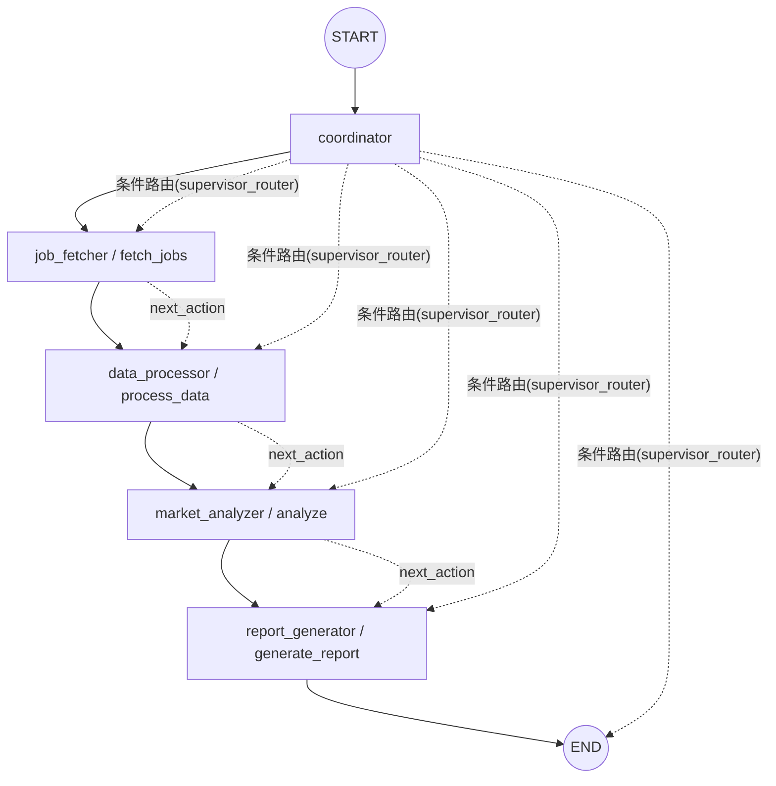
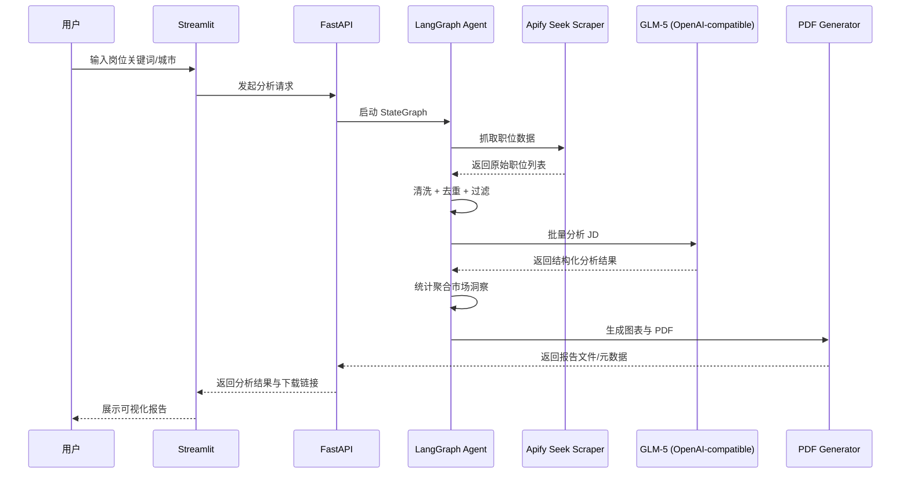

# 系统架构文档

## 1. 概述

本项目是一个**AI 驱动的澳洲职位市场研究工具**，面向求职者、职业咨询者与开源社区开发者，提供从职位采集到市场洞察输出的一体化能力。

核心价值聚焦三件事：

- 自动化职位采集：通过 Apify Seek Scraper 批量抓取澳洲职位数据
- LLM 智能分析：基于 OpenAI-compatible 接口调用 GLM-5，对职位描述进行结构化提取与语义分析
- 可视化报告生成：输出可交付的图表化市场分析结果，并支持 PDF 导出

## 2. 系统架构图

## 3. 核心组件

### 3.1 LangGraph Agent 架构（重点）

项目使用 `StateGraph` 组织多阶段处理流程，将“采集-处理-分析-报告”建模为可路由状态机。

- 图入口：`START -> coordinator`
- 路由机制：每个节点更新 `next_action`，由 `supervisor_router` 决定下一跳
- 错误处理：节点将异常信息累计到 `errors`，避免单点失败导致全流程崩溃

> 节点命名说明：
> 文档语义节点为 `coordinator / job_fetcher / data_processor / market_analyzer / report_generator`；
> 代码中的图节点标识为 `coordinator / fetch_jobs / process_data / analyze / generate_report`，二者一一对应。

节点职责：

- `coordinator`：解析查询并决定初始动作（当前默认进入抓取）
- `job_fetcher`：调用 Apify 抓取职位数据，并按 `job_id` 去重
- `data_processor`：执行数据清洗、低薪过滤、样本概览统计
- `market_analyzer`：调用 LLM 分析 JD，提取技能/经验/行业，并聚合市场洞察
- `report_generator`：生成结构化报告内容并准备 PDF 输出元数据

### 3.2 LLM 集成

LLM 层采用 OpenAI-compatible 适配模式，降低对单一模型供应商的耦合：

- 客户端：`AsyncOpenAI`
- 接口模式：`chat.completions.create`
- 配置项：
  - `LLM_BASE_URL`：兼容 OpenAI 协议的服务地址
  - `LLM_API_KEY`：认证密钥
  - `LLM_MODEL`：默认 `glm-5`
- 工程特性：异步调用、指数退避重试（限流/连接错误）、统一 JSON 解析

### 3.3 数据管道

职位数据处理链路：

- 数据源：Apify 的 `websift~seek-job-scraper`
- 抓取阶段：按关键词与地点抓取职位列表
- 清洗阶段：标准字段映射（标题、公司、地点、薪资、描述等）
- 去重阶段：基于 `job_id` 去重
- 分析阶段：将清洗后职位送入 LLM 批量分析（默认批次大小 5）

### 3.4 PDF 生成

报告导出采用 HTML 模板渲染 + PDF 引擎方案：

- 渲染：Jinja2 模板（缺失时回退内联模板）
- 制图：Matplotlib 生成薪资/技能分布图，嵌入 Base64 图片
- 转 PDF：WeasyPrint 将 HTML/CSS 转为 A4 报告
- 中文字体：优先 `Noto Sans CJK SC`，并回退 `Microsoft YaHei` / `PingFang SC`，保障中文可读性

## 4. 技术选型说明

### 为什么选择 LangGraph

- 天然适配多节点、多阶段 Agent 流程
- `StateGraph` 对状态流转与路由控制清晰可维护
- 便于将 LLM 分析、数据处理、报告生成拆分为可测试节点

### 为什么选择 Streamlit

- 研发成本低，适合快速构建数据产品前端
- 对图表和表格展示友好，适合市场洞察场景
- 与 Python 后端生态一致，便于开源社区二次开发

### 为什么选择 WeasyPrint

- 支持标准 HTML/CSS，报告模板可读、易迭代
- 对打印版式（A4、分页、样式）控制能力强
- 与 Matplotlib、Jinja2 组合后可稳定输出高质量 PDF

## 5. 数据流

对应流程可概括为：

**用户查询 → Apify 爬取 → LLM 分析 → 统计聚合 → PDF 生成**。
